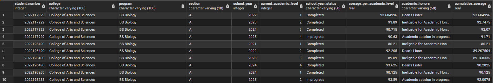
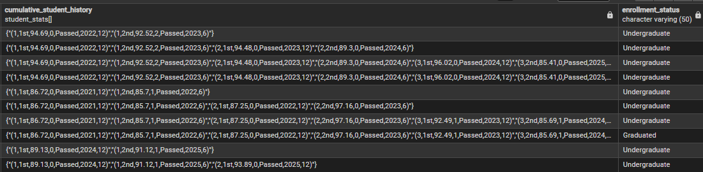

# Student-History-Vault
This is a Data Pipeline with temporal modeling project designed to manage and track student records within a University setting. Capturing how student metrics such as academic averages, attendance, and honors eligibility evolve over multiple semesters.
  The system supports:
  - Incremental Updates (for efficient, periodic data ingestion)
  - Batch Reconstructive Views (for generating a complete historical record easily)

## 📌 Overview

This is a project that I will pitch to my University. A robust SQL-based data pipeline designed to manage and track student records by utilizing **temporal modeling** to track the changes in their academic performance. The output contains columns such as **average per academic level, cumulative average, cumulative student history, and academic honors**

## 🧰 Tech Stack

- **Database:** PostgreSQL (Advanced Types, Arrays, and CTEs)
- **Concepts:** Temporal Data Modeling, ETL Staging, SCD (Slowly Changing Dimensions) logic
- **Languages:** SQL

## 🧠 Objectives

I've seen the inefficiencies within my University in calculating academic awards eligebility. By utilizing this data pipeline alongside data from our student portal, I aim to:
  1. Save countless hours for the faculties, students, chairpersons, and deans of the university
  2. Maintain a cleaner Historical data of Student Records for easier tracking.

🛢️ SQL:
[student-history-vault.sql](student-history-vault.sql)

  Includes:
  - Incremental (Iterative) Update Query
  - Batch (Reconstructive) View Query
    
## 📊 Processed Data :

File: [student_cmd.xlsx](student_cmd.xlsx)

## 📊 Raw Data :
File: [student_performance_raw.csv](student_performance_raw.csv)

## ✉️ Contact
For questions, feedback, or collaboration:

**Email**📧: dylancortez.data@gmail.com

**LinkedIn**➡️: https://www.linkedin.com/in/dylan-anthony-cortez/
